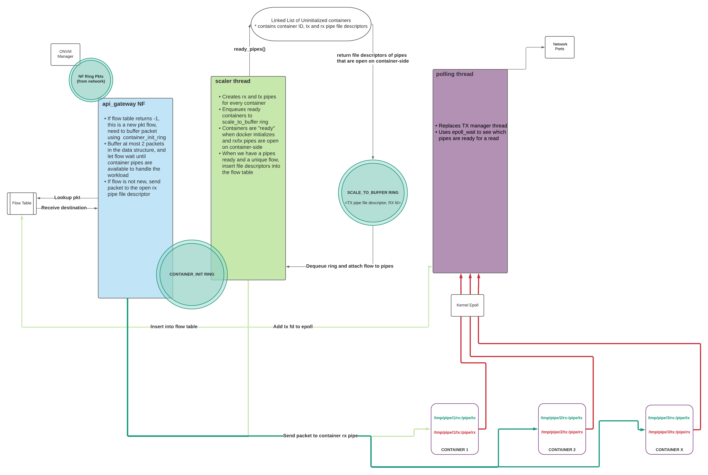

Single Use Flow Container NF - ONVM
==
The Single Use Container NF system is designed with security and access control in mind. Each IP flow is routed by the api_gateway NF to a unique Docker container on the machine. The containers are separated and cannot access the shared memory of other user flows. The NF handles RX and TX of the containers using named pipes and docker volumes for communication. In Figure 1 below, we see how the threads on the NF interact using rings to initialize containers, and pipes when the system load increases. The epoll syscall is used for efficient polling of container NF pipes to see when data needs to be sent out of the network.


*Figure 1. Diagram of Single Use Flow Container NF*


# Features 
## API Gateway NF

The API Gateway NF serves as a flow director for the container system. It receives a packet from the ONVM manager, looks up its destination in the flow table, and sends it to the container via a pipe communication system. In the case of a new packet flow, the packet is buffered while the scaling thread initializes the RX and TX pipes for communication between the gateway and the container, and the flow is added to the flow table when the setup is complete and the container is ready.

### Compilation and Execution
```
cd examples
make
cd api_gateway
./go.sh SERVICE_ID [-n MAX_CONTAINERS] [-p PRINT_DELAY]
OR
./go.sh -F CONFIG_FILE -- -- [-n MAX_CONTAINERS] [-p PRINT_DELAY]
```

### App Specific Arguments

- -p PRINT_DELAY: Number of packets between each print, e.g. -p 1 prints every packet 
- -n MAX_CONTAINERS: Maximum number of containers to scale to 


## Scaling Thread

The scaler is responsible for maintaining a specific number of containers at any point in time. This can be set at runtime or as a constant in the `api_gateway.h` file. It also has a pipe API to bring up Docker containers via `docker stack`, and initialize their pipes for communication. Since the containers take an inconsistent amount of time to start up, we continuously run `ready_pipes` to confirm if a container is actually ready to receive packets. Finally, once we have a container and a unique IP flow on the system, we pair them and flush buffered packets to the new pipe file descriptors.

## Polling Thread

The poller takes the place of the normal TX thread in ONVM. Where normally we wait on the NF rings to send packets out, now we have pipes to check for data. `epoll` allows us to efficiently track this in the kernel and receive data only from the containers that have processed packets. 

# Installation and Setup

The `api_gateway` NF itself does not have many dependencies, however the `scaler` requires a few critical setup steps. To install everything, cd into `examples/api_gateway/scaler` and execute `./setup.sh`.
Ensure the correct versions are installed. The implementation has been tested with 

- Ubuntu 18.04 
    - Run `lsb_release -a`
    ```
    No LSB modules are available.
    Distributor ID: Ubuntu
    Description:    Ubuntu 18.04.5 LTS
    Release:        18.04
    Codename:       bionic
    ```
- Docker 20.10
    - Run `docker -v`
    Docker version 20.10.6, build 370c289
- Docker Swarm connection established
    - Run `docker node ls`
    ```
    ID     HOSTNAME   STATUS    AVAILABILITY   MANAGER STATUS   ENGINE VERSION
    <id> * <hostname> Ready     Active         Leader           20.10.6
    ```

## Compilation and Execution
- Run `make clean && make` inside `onvm` and `examples/api_gateway` in that order
- Compile the Docker container NF image
    ```
    cd examples/api_gateway/scaler
    sudo docker build -t cont_nf:latest .
    ```
- If there were no errors, we should be able to run the Testing configuration below
Testing

We will run the speed_tester with a pcap input to generate load to run through the api_gateway NF. Run the manager with enough cores and any stats output. Here is an example to run for this test.
```
// manager
cd onvm
./go.sh -k 0 -n 0x3F0 -s stdout
```

In a separate pane, start up the api_gateway. Once started, wait for the docker output to converge (this means all containers are initialized and we can accept input).
```
// api_gateway
cd examples/api_gateway
// kill the previous run's docker service
docker stack rm skeleton
./go.sh 1
```

Finally, in another pane, start the speed_tester. Make sure to have compiled with `ENABLE_PCAP=1` in the Makefile.
```
// speed_tester
cd examples/speed_tester
// destination 1 (api_gateway) with a test pcap file
./go.sh 2 -d 1 -o pcap/pktgen_test1.pcap
```
The end result should be the containers are receiving packets to their respective IP flows and logging data about their packets. 
